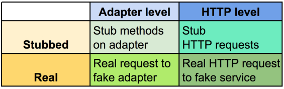

# Consuming and Testing External APIs

### Consuming APIs

We'll be using a Rails app, but it certainly isn't required. In many cases, a RESTful API can be accessed just like any other website.

```sh
curl http://hipsterjesus.com/api
```

You should see a JSON output in the terminal.

If we visit the API endpoint in our browser, we'll be able to see the JSON output directly. (**Pro Tip:** Get the [JSONView browser](https://chrome.google.com/webstore/detail/jsonview/chklaanhfefbnpoihckbnefhakgolnmc?hl=en) extension for Chrome)

### Using HTTP Clients

Basically, we are just visiting a website using Ruby, and then doing stuff with the output. To access a website in Ruby, we need to use an HTTP client.
HTTP clients allow us to GET (and POST or otherwise interact with) info from external websites. There are a number of HTTP clients out there that wrap Ruby's native [`Net:HTTP` library](http://ruby-doc.org/stdlib-2.3.1/libdoc/net/http/rdoc/Net/HTTP.html).

Today, we'll be using [HTTParty](https://github.com/jnunemaker/httparty). HTTParty is pretty straightforward to use immediately.

From the app, run `rails c`, which loads our entire dev environment, including the `HTTParty` gem.

`HTTParty.get("http://hipsterjesus.com/api")`

Alternately, if `HTTParty` is installed on your machine, you can even go right into Pry - no Ruby file or Rails app needed!

```sh
$ > pry
$ [1] pry(main)> require 'HTTParty'
=> true
$ [2] pry(main)> HTTParty.get("http://hipsterjesus.com/api")
```

### Where in my Rails app...?

Since HTTP calls can happen from anywhere, we typically wrap them in their own Ruby object. In a Rails app, this Ruby class might live in the `lib` folder, or it might be a model that **does not inherit from `ActiveRecord::Base`**. This is sometimes referred to as a **Plain Old Ruby Object** (PORO).

### Building Objects to Handle External API Interactions

We want to build a class that makes that call for us, which we could then access from controllers or other models in our app.

```ruby
class HipsterIpsum
  include HTTParty
  base_uri "http://hipsterjesus.com"

  def fetch_data
    # this is the same as `HTTParty.get("http://hipsterjesus.com")`
    self.class.get("/api")
  end

  # this handles the output
  def hipster_text
    fetch_data["text"]
  end
end
```

If the output is complex, we may have a separate class that wraps the response in an object.

```ruby
class Hipster
  attr_reader :text, :type

  def initialize
    @text = text
    @type = type
  end

  def text
    get_hipster_data["text"]
  end

  def type
    get_hipster_data["params"]["type"]
  end

  private

  def get_hipster_data
    @hipster_data ||= HipsterIpsum.new.fetch_data
  end
end
```

### Working with External APIs

Half the battle is reading the docs. For example, HTTParty provides an example using the [StackExcahnge API](https://api.stackexchange.com/docs)

```ruby
class StackExchange
  include HTTParty
  base_uri 'api.stackexchange.com'

  def initialize(service, page)
    @options = { query: { site: service, page: page } }
  end

  def questions
    # the options hash gets converted into a query string
    self.class.get("/2.2/questions", @options)
  end

  def users
    self.class.get("/2.2/users", @options)
  end
end

stack_exchange = StackExchange.new("stackoverflow", 1)
stack_exchange.questions
```

This is the URL we get:
http://api.stackexchange.com/2.2/questions?site=stackoverflow&page=1

### Testing APIs

[](https://github.com/JoelQ/weekly-iteration-faking-apis)  
Source: https://github.com/JoelQ/weekly-iteration-faking-apis

The idea is that we do not want to make requests to an external resource every time we run our tests, for a variety of reasons. From a practical standpoint:

- APIs may rate-limit your usage, and you'll burn through your allotted usage each time you run your tests
- You need to be connected to the Internet
- It takes longer
- APIs don't change that often
- You really care about your code working with the **data structure** that the API returns

We will cover the **Real** test cases, as opposed to the **Stubbed** cases. We won't get into why to use Real vs. Stubbed, as that is an entire conversation in itself. Since the "Real" test cases are (naturally) closer to reality without actually making the API call, we'll cover those.

### Real HTTP Request to Fake HTTP Service

[VCR](https://github.com/vcr/vcr) is a gem that intercepts any outgoing HTTP requests from our app (in test) and returns a fake HTTP response that is stored in a YAML file (`cassette`).

1. Add VCR to your `Gemfile`

2. Create a file `spec/support/vcr.rb` and add the following configuration info:

```rb
require "vcr"

VCR.configure do |c|
  c.cassette_library_dir = "spec/vcr_cassettes"
  c.hook_into :webmock
  c.ignore_localhost = true
  c.configure_rspec_metadata!
  c.default_cassette_options = { record: :new_episodes }
  c.allow_http_connections_when_no_cassette = false
end
```

`record: :new_episodes` makes a real HTTP request the first time, and saves it into a `.yml` file ("cassette"), with a name that you specify (see test example below).

3. Now you are ready to add VCR to specific tests. Here is an example:

```rb
describe "#fetch_data", vcr: { cassette_name: "hipster_ipsum" } do
  it "returns HTTParty::Response with text" do
    hipster_data = HipsterIpsum.new.fetch_data

    expect(hipster_data.class).to eq HTTParty::Response
    expect(hipster_data.code).to eq 200

    expect(hipster_data["text"]).to be_a String
    expect(hipster_data["text"]).to include "Listicle VHS meggings placeat occaecat"
  end
end
```

All you need to do is add `vcr: { cassette_name: "file_name_here" }` after the quote in your `describe` statement. This is a hash, and the `vcr:` statement signifies that you want to use VCR for the enclosed tests.

### Fake Adapter

Instead of a fake HTTP response, we never make an HTTP call at all. We swap out the class (aka PORO) that makes the call and return just the results that we are looking for.

We can update our `Hipster` class as follows:

```rb
class Hipster
  @@api = HipsterIpsum
  cattr_accessor :api

  attr_reader :text, :type

  def initialize
    @text = text
    @type = type
  end

  def text
    get_hipster_data["text"]
  end

  def type
    get_hipster_data["params"]["type"]
  end

  private

  def get_hipster_data
    @hipster_data ||= api.new.fetch_data
  end
end
```

Notice that the actual call is made in the private method `get_hipster_data`. `.new.fetch_data` is being called on a class - and by default, that class is set to `HipsterIpsum`.

This is stored in a class variable `@@api`, which means that it will be accessible to all instances of the `Hipster` class.

`cattr_accessor` is a "class attr accessor". It's a Rails thing, and it behaves like an `attr_accessor`, but for __class variables__.

Finally, note the [__memoization pattern__](http://gavinmiller.io/2013/basics-of-ruby-memoization/) used here. We make the API call once (via `.new.fetch_data`), and thereafter, the data is stored in `@hipster_data`.

Back to this code: `api.new.fetch_data`.

`api` is a reader for the class variable `@@api`, which is currently set to `HipsterIpsum`. So in most cases, this line translates to:

`HipsterIpsum.new.fetch_data`

That's the normal HTTP request. But now, we can swap out `HipsterIpsum` with a fake class that just returns a static hash every time we call `.new.fetch_data`.

```ruby
class HipsterIpsumFake
  def fetch_data
    {
      "text" => "blarg",
      "params" => { "type" => "hipster-greek" }
    }
  end
end
```

The hash is structured to work with our method calls. We need to be able to call `get_hipster_data["text"]` and `get_hipster_data["params"]["type"]`, so we construct our hash to serve just those purposes. Now we are able to separate the concern of testing our `Hipster` object from the API call where the data is derived.

Finally, we make the switch in our `rails_helper` file - just for our tests.

```ruby
# ...config stuff here...
Hipster.api = HipsterIpsumFake

RSpec.configure do |config|
  config.include FactoryGirl::Syntax::Methods
  config.use_transactional_fixtures = false
  config.infer_spec_type_from_file_location!
end
```

### Troubleshooting

If VCR does not seem to be making cassettes or catching HTTP requests, you might need to explicitly require `webmock`. Add the following line to your `rails_helper.rb` file:

`require 'webmock/rspec'`

### Additional Resources

- [Faking Third-Party APIs](https://github.com/justinhuynh/weekly-iteration-faking-apis)
- [Horizon Lesson: Consuming Web APIs](https://learn.launchacademy.com/lessons/consuming-web-apis)
